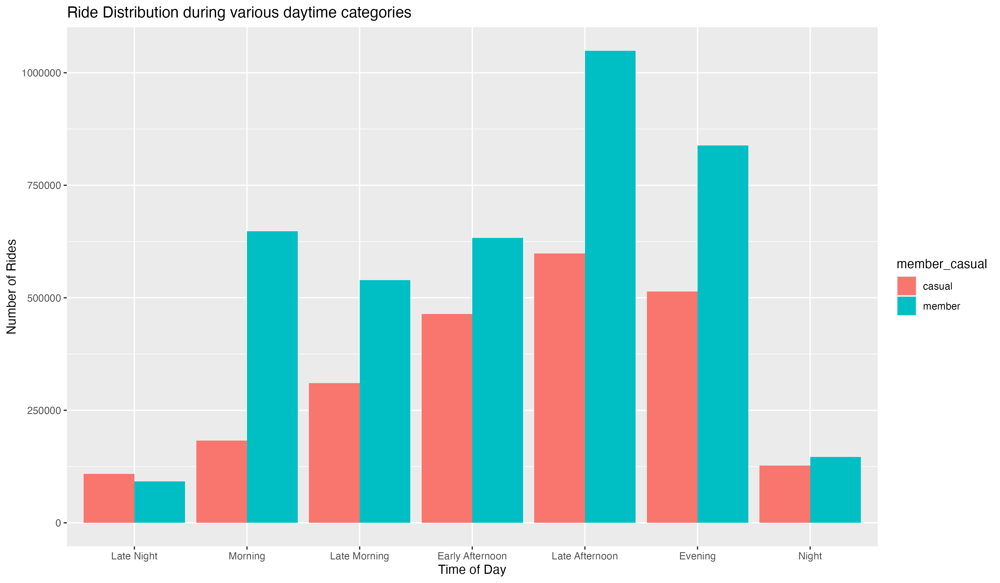
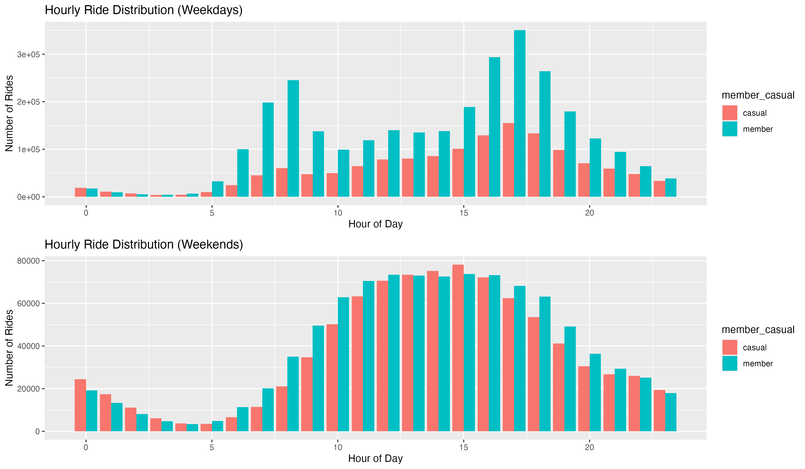

# Data Analytics Case Study: Cyclists
Done as a part of Google Data Analytics Professional Certificate

-----
Author: Alan Abraham Puthenparambil Kochumon

Date: 25th October 2025

Stakeholder: Lily Moreno, Chief Marketing Director, Cyclists.

----

## 1. Ask (Ask.R)

### Main Business Goal
Design marketing strategies aimed at converting casual riders into annual members

### Subquestions
1. How do annual members and casual riders use Cyclistic bikes differently?
2. Why would casual riders buy Cyclistic annual memberships?
3. How can Cyclistic use digital media to influence casual riders to become members?

### Question Answered by Case Study
How do annual members and casual riders use Cyclistic bikes differently?

### Guiding Questions
1. Do casual riders take longer or shorter ride than members?
2. Are casual riders more active on weekends vs weekdays?
3. Are they concentrated in certain months (seasonality or location patterns)?
4. What time of day do members vs casual riders prefer?

---

## 2. Prepare (Prepare.R)

### Metadata about dataset
**Location**: Data is located in the public repository of Divvy.

**Data Organization**: Ride data for each month is collected as a separate csv file, containing metrics like ride length(duration), latitude and longitude of start and end station, start and end station id and name, starting datetime and ending datetime, a rider id (used to associate with rider details), rideable type and whether the rider is a member or casual rider.

### Does the Data ROCC?

* **Reliable**: Yes, it’s a dataset collected and published by Motivate Inc, a reputable operator of bike-share systems.
* **Original**: Yes, the dataset is original since it’s collected from Divvy’s share systems by Motivate International Inc during course of regular operations.
* **Current**: Yes, the dataset contains data for the last twelve months from the current date.
* **Cited**: Yes, the data source is clearly cited as being provided by Motivate International Inc., the operator of the Divvy service, and is publicly available through their specified repository. This transparency allows for verification of the data's origin and collection methods.

### Data Privacy and Licensing

#### Licensing
The Divvy trip data, which is owned by the City of Chicago, is made available to the public by Motivate International Inc., the operator of the service. As stated in the Divvy data license agreement, users are granted a non-exclusive, royalty-free, limited, and perpetual license to access, reproduce, analyze, copy, and distribute the data for any lawful purpose. As a data analyst, my analysis for this case study falls under this license. In a real-world scenario, I would ensure that any use aligns with the specific terms to avoid potential issues. 

#### Privacy
The Divvy dataset is designed to protect rider privacy by redacting all personally identifiable information (PII). This includes removing data that could connect trips to individual riders, such as credit card numbers and specific user IDs. The coordinates included in the dataset correspond to public Divvy bike stations, not individual locations, further protecting rider privacy. This anonymization prevents me from tracking individual riders, which is a necessary and ethical consideration for this analysis.

#### Security
For this public dataset, the primary security risks lie in my local handling of the data, as the source repository is managed by Motivate International Inc.. To address this, I will store the downloaded data files in a secure location on my local machine. My work will be performed on a secure, private network to prevent interception. Since the dataset is anonymized, the security risk of a data breach is significantly minimized. For any derived or aggregated data I create, I will apply similar security best practices.

#### Accessibility
 The public nature of the dataset supports data democratization by making information accessible to a wide audience. Beyond the data's availability, I am committed to ensuring that my final analysis and visualizations are accessible to all stakeholders, including those with disabilities. My presentation will incorporate best practices such as use of clear language, accessible visuals with proper alt texts and contrasts, and considerations for people with different technical backgrounds.

### First Steps
I loaded data for each month and aggregated them into a single file. This allows me to load the dataset into other 
stages easily without looping and loading each file.

---

## 3. Process (Process.R)
1. The data was first loading into a data frame.
2. The labels were cleaned, and any duplicates were removed.
3. The timezones for `started_at` and `ended_at` were updated to use the Chicago timezone. (Explained in "What I 
   Learned" section).
4. Each Ride Length was categorized into interval of 5 minutes, which was later cut short to `30 - 45`, `45 - 60` 
   and `60+` minutes.
5. Then, I extracted the start day of the week, and month from the `started_at` attribute. Moreover, I mapped each 
   month number to month name, as it can make reading the graphs and dataset a lot easier later down the line.
6. After that, I wrote a utility function that converts difference between start and end latitudes to distance in KM.
7. Then, the hours of the day attribute (derived) was categorized into different time periods like `"Late Night"`, 
   `"Morning"`, `"Late Morning"`, etc. to easily get a grasp of time categorization.
8. After that, I started checking for `na` values for `start_station_name` and `start_station_id`, and found that 
   almost 20% of the dataset were missing that information. Since, dropping the dataset may skew the data and since 
   many other attributes are filled for observations having missing stations, I decided to leave it without dropping 
   them.
9. To ensure there is no bias in missing station information among rider types (casual and members), I ran a quick 
   check and found out that the missing data was almost evenly distributed.
10. Then, I checked for missing information among rideable types (electric bike, scooter, and classical bike). None
    of the classic bikes have missing location, 32.9% of electric bike have missing location, and 46.9% of electric
    scooters have missing location 

11. An interesting insight I got was that Electric Scooters only had limited data associated with them, so I decided to analyze them further.
12. Upon further inspection, the electric scooters were found to be only around 2% of the entire dataset, with half of them missing location data, so I decided to drop them.
13. Next I look for invalid rides, namely, ones that have 0km distance or those with an unreasonable distance rode for a limited time (greater than 2KM (max speed of scooter assumed to 80KM/s), and duration of less than 1 minute).
14. ~~I also dropped rides that were 0KM, and had the same origin and finishing latitudes and longitudes.~~ Those were likely round trips, so I decided to keep them.
15. Finally, after dropping rides having `na` for distance and ride duration category. I exported the dataset for another the next step.

---

## 4. Analyze

---

## 5. Share

### 1. Ride Duration Categorized for Members and Casual Riders

We can observe that casual members dominate 30+ minute ride. This could mean that members use bike routine commutes while casuals use them for leisure.

### 2. Ride Popularity During Weekdays vs Weekends

We can observe that the usage is more distributed for members while casual rides tend to increase day by day until **Saturday** and shows a **small drop on Sunday**. The higher rides on weekends suggests that casual riders use bikes for leisure.

### 3. Monthly Distribution of Casual vs Members

We can observe that rides are lower rides during winter months (Dec - Feb).
But it increases from there and peaks during summer months, particularly August, which are vacation months.
Although member rides also fall, we can see more consistent member rides, suggesting members usually use bike for commute.

### 4. Ride Distribution during various Times of the Day

We can see that the rides, both for casuals and members increase throughout the day, with both rides dipping after evening.

#### For Additional Insight, we can compare hourly ride insights

We can observe that the rides, both for casuals and members increase throughout the day, with both rides dipping after evening.

### 5. Verifying that members use rides majorly for commute
We can filter and separate weekends and weekdays to see riders' commute patterns.

More member rides use bike during weekdays to commute to work.
However, we can a lot of night rides during weekends, for both casual and members.

### 6. Usage Patterns of Electric vs Classic Bikes among Member and Casual Riders

Both ride types are used by members and casuals with members leading the chart.
Electric bikes are preferred by both members and casuals.

### 7. Usage Patterns of Electric vs Classic Bikes among Member and Casual Riders by Day of Week

We can see that members use classic bike more or less consistently throughout the week.
But casuals use both classic and electric bikes during the weekend more, indicating further that casuals use bikes for leisure.

---

## 6. Act

1. TODO
2. TODO
3. TODO
4. TODO

## What I Learned
1. Make sure to correctly add the timezone to datetime fields. This is especially true if the data was collected in a timezone different from yours.
2. If you want to preserve order, use factoring.
3. Some mistakes can reveal after data cleaning. If you keep a track of data, and the steps taken, and use version control, it is easy to go in and make necessary changes easily. (I misinterpreted 0KM rides as invalid, but there is big possibility that the rides started and ended at the same station)